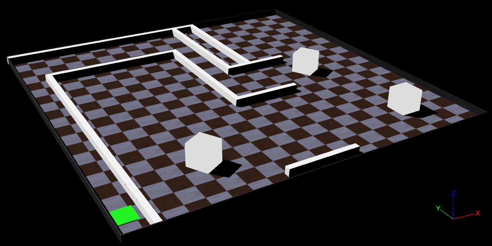

# Desarrollo y evaluación de algoritmos para el mapeo de entornos y generación de trayectorias utilizando sistemas robóticos multi-agente Este trabajo de investigación se centra en la creación y combinación de tres algoritmos principales para la navegación autónoma de vehículos de tracción diferencial.

Este trabajo de investigación se centra en la creación y combinación de tres algoritmos principales para la navegación autónoma de vehículos de tracción diferencial:

1. Exploración de entornos
2. Mapeo bidimensional de entornos
3. Generación óptima de trayectorias

Estos algoritmos están diseñados específicamente para vehículos de tracción diferencial equipados principalmente con sensores de distancia. El objetivo es comprender cómo estos vehículos interactúan en entornos desconocidos, utilizando sensores de distancia, sensores de posición de ruedas y una brújula.

La validación se llevó a cabo mediante simulaciones computarizadas en entornos diversos, evaluando la precisión de los algoritmos en términos de tiempo de simulación y posición inicial del vehículo, combinada con la precisión al ejecutar la trayectoria óptima hacia el punto de interés.

Estas pruebas proporcionan información sobre el rendimiento y la optimización de los algoritmos para aplicaciones prácticas en la navegación autónoma de vehículos de tracción diferencial.

  

